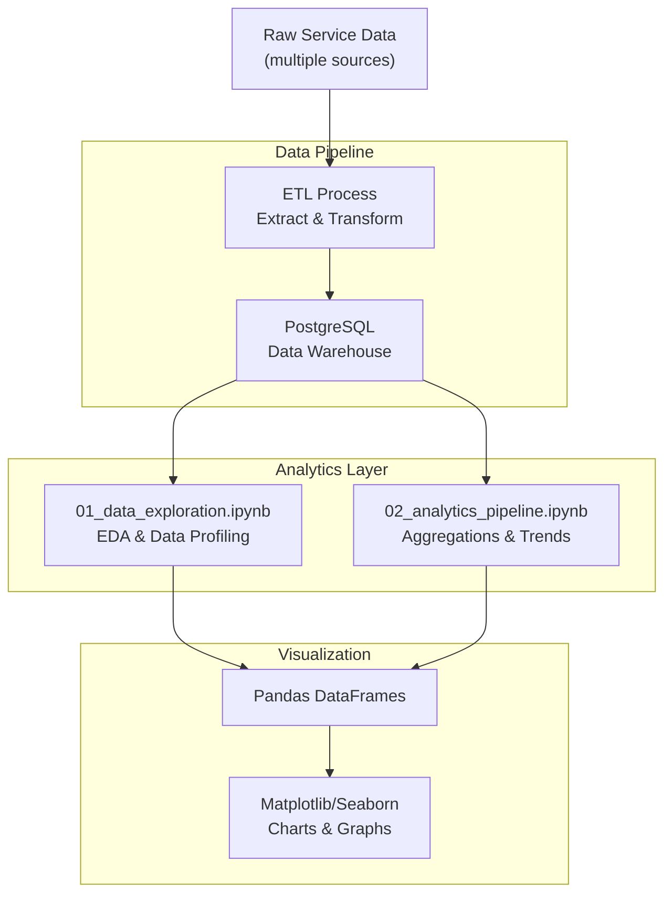

# Service Analytics Dashboard - Architecture

## System Overview

Service Analytics Dashboard is a comprehensive analytics platform for tracking and analyzing service metrics using PostgreSQL data warehouse and Jupyter notebooks for analysis and visualization.



## Database Schema

### Services Table
```sql
services (
    id: SERIAL PRIMARY KEY,
    service_id: VARCHAR(50) UNIQUE,
    service_name: VARCHAR(255),
    category: VARCHAR(100),
    status: VARCHAR(20) [active/inactive]
)
```
- 8 different services tracked
- Categories: Support, Implementation, Operations, Development, Education, Advisory, Technical, Optimization

### Daily Metrics Table
```sql
daily_metrics (
    id: SERIAL PRIMARY KEY,
    service_id: VARCHAR(50) FK,
    metric_date: DATE,
    total_requests: INT,
    completed_requests: INT,
    failed_requests: INT,
    avg_resolution_time_minutes: INT,
    avg_customer_satisfaction: NUMERIC(3,2),
    revenue: NUMERIC(12,2),
    peak_hour: INT
)
```
- 720+ records (8 services × 90 days)
- Tracks daily performance metrics
- Unique index on (service_id, metric_date)

### KPIs Table
```sql
kpis (
    id: SERIAL PRIMARY KEY,
    kpi_date: DATE UNIQUE,
    total_daily_volume: INT,
    avg_resolution_time: INT,
    customer_satisfaction_score: NUMERIC(3,2),
    revenue_by_region: JSONB {North, South, East, West},
    top_service: VARCHAR(100),
    success_rate: NUMERIC(5,2)
)
```
- 90 daily KPI records
- Aggregated metrics across all services
- Regional revenue breakdown in JSON

## Data Models & Analysis

### Notebook 1: Data Exploration (01_data_exploration.ipynb)
- **Data Loading**: Connect to PostgreSQL, fetch data
- **Data Profiling**: 
  - Shape and size of datasets
  - Data types and missing values
  - Statistical summaries (mean, median, std dev)
- **Initial Visualizations**:
  - Distribution of total requests
  - Resolution time trends
  - Customer satisfaction by service
  - Revenue distribution
- **Data Quality Checks**:
  - Outlier detection
  - Missing value analysis
  - Data integrity validation

### Notebook 2: Analytics Pipeline (02_analytics_pipeline.ipynb)
- **Time Series Analysis**:
  - Rolling averages (7, 14, 30 days)
  - Trend analysis
  - Seasonality detection
- **Service Performance**:
  - Success rate by service
  - Resolution time trends
  - Cost per request
- **Regional Analysis**:
  - Revenue breakdown by region
  - Regional performance comparison
  - Growth rates by region
- **Customer Insights**:
  - Satisfaction trends
  - Correlation between metrics
  - Risk indicators
- **Dashboards**:
  - Executive summary KPIs
  - Service performance heatmaps
  - Revenue trends and forecasts

## Key Metrics Tracked

### Service Metrics (per day)
- **Total Requests**: Number of service requests received
- **Completed Requests**: Successfully completed requests
- **Failed Requests**: Failed or unresolved requests
- **Success Rate**: (Completed / Total) × 100%
- **Avg Resolution Time**: Average time to resolve (minutes)
- **Customer Satisfaction**: Rating 1-5 scale
- **Revenue**: Daily revenue generated
- **Peak Hour**: Hour with highest activity

### Aggregated KPIs (daily)
- **Total Daily Volume**: All service requests across company
- **Avg Resolution Time**: Company-wide average
- **Customer Satisfaction Score**: Overall satisfaction metric
- **Revenue by Region**: North, South, East, West breakdown
- **Top Service**: Service with most completions
- **Success Rate**: Overall success percentage

## Views for Analytics

### service_performance_30days
- Shows last 30 days of service performance
- Includes success rates and customer satisfaction
- Optimized for trend analysis

### revenue_by_region_daily
- Regional revenue breakdown
- 90-day view
- Supports regional performance comparison

## Database Indexes

```sql
idx_daily_metrics_service_date      -- (service_id, metric_date DESC)
idx_daily_metrics_date              -- (metric_date DESC)
idx_kpis_date                       -- (kpi_date DESC)
idx_services_status                 -- (status)
```

Indexes optimize:
- Time range queries
- Service-specific analysis
- Date-based aggregations

## Analytics Queries

### Example 1: Service Performance Last 7 Days
```sql
SELECT * FROM service_performance_30days
WHERE date >= CURRENT_DATE - INTERVAL '7 days'
ORDER BY date DESC;
```

### Example 2: Revenue Trends by Region
```sql
SELECT kpi_date, revenue_by_region->>'North' as north,
       revenue_by_region->>'South' as south,
       revenue_by_region->>'East' as east,
       revenue_by_region->>'West' as west
FROM kpis
WHERE kpi_date >= CURRENT_DATE - INTERVAL '30 days'
ORDER BY kpi_date DESC;
```

### Example 3: Service Success Rate Trend
```sql
SELECT service_id, metric_date,
       ROUND(100.0 * completed_requests / NULLIF(total_requests, 0), 2) as success_pct
FROM daily_metrics
WHERE metric_date >= CURRENT_DATE - INTERVAL '30 days'
ORDER BY service_id, metric_date DESC;
```

## Technology Stack

- **Database**: PostgreSQL 12+
  - JSONB for nested data (regional revenue)
  - Indexes for query optimization
  - Views for reusable analytics queries

- **Data Processing**: 
  - Python 3.8+
  - pandas: Data manipulation and aggregation
  - NumPy: Numerical operations

- **Analytics**: Jupyter Notebooks
  - Interactive analysis
  - Data exploration
  - Visual storytelling

- **Visualization**: 
  - Matplotlib: Line charts, bar charts
  - Seaborn: Statistical visualizations
  - Pandas plotting: Quick charts

- **ETL**: Custom Python scripts
  - generate_metrics.py: Aggregate raw data
  - Data validation and quality checks

## Data Flow

```
Raw Service Data (Multiple Sources)
    ↓
[ETL/Extract Phase]
    ↓
PostgreSQL Database
    ↓ (Scheduled aggregation)
KPI Calculation
    ↓
Daily KPI Records Stored
    ↓
Jupyter Notebooks
    ↓ (Data scientists/analysts)
SQL Queries + pandas DataFrames
    ↓
Visualizations & Insights
    ↓
Business Dashboards & Reports
```

## Query Performance

- Average query time: < 100ms for last 30 days
- Daily metrics lookup: < 50ms
- Regional aggregation: < 200ms
- Indexes ensure consistent O(log n) lookups

## Scalability

1. **Partitioning**: Can partition by date for historical data
2. **Archival**: Move data > 1 year to archive tables
3. **Materialized Views**: Pre-compute common aggregations
4. **Caching**: Cache frequently generated reports
5. **Horizontal Scaling**: Read replicas for analytics

## Data Quality

- 10 automated SQL tests validate:
  - Data completeness
  - Value ranges
  - Unique constraints
  - Referential integrity
  - Aggregation consistency

## Use Cases

1. **Trend Analysis**: Identify service performance trends
2. **Forecasting**: Predict future service demands
3. **Regional Comparison**: Compare region performance
4. **Anomaly Detection**: Find unusual patterns
5. **Cost Analysis**: Track revenue and margins
6. **SLA Monitoring**: Ensure service level agreements
7. **Capacity Planning**: Plan resources based on trends

## Sample Data

- **90 days** of historical data
- **8 services** tracked continuously
- **720+ daily records** (8 × 90)
- **90 KPI summaries** (one per day)
- Realistic distribution of metrics
